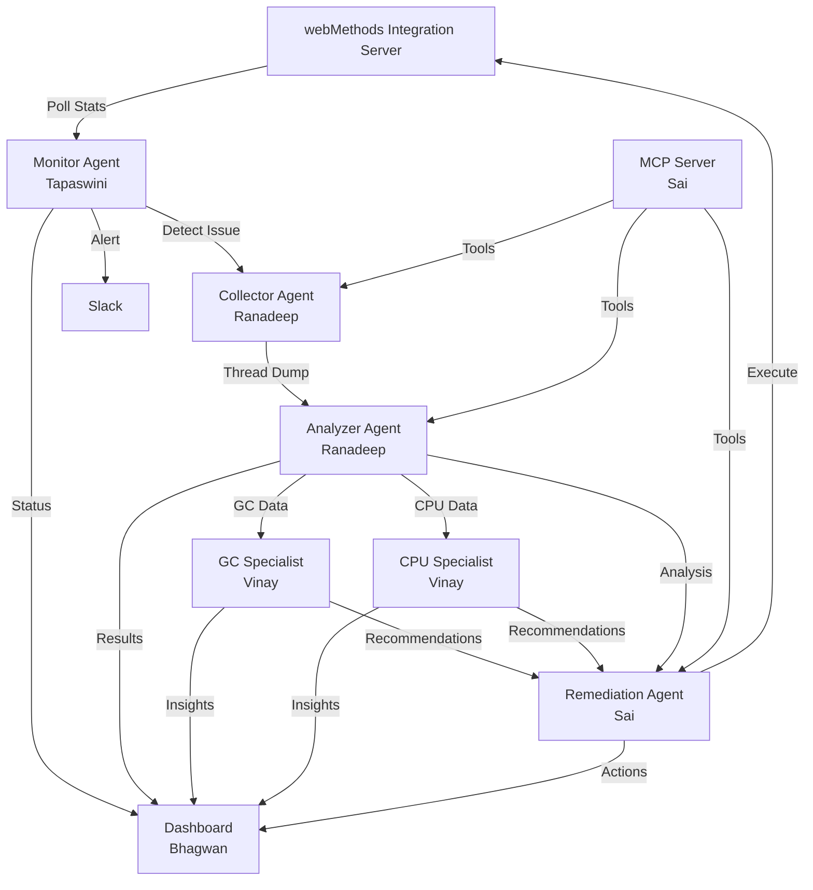

# Thread Dump Analysis AI Agent - 1 Hour Implementation Plan

## Timeline Overview
**Total Duration:** 60 minutes  
**Start Time:** Now  
**Target Completion:** +60 minutes

---

## Phase 1: Project Setup (0-10 minutes)

### Shared Setup Tasks (All Team Members)
1. **Create project structure:**
   ```
   thread_dump_analysis/
   ├── agents/
   │   ├── monitor/          # Tapaswini
   │   ├── collector/        # Ranadeep
   │   ├── analyzer/         # Ranadeep
   │   ├── gc_specialist/    # Vinay
   │   ├── cpu_specialist/   # Vinay
   │   └── remediation/      # Sai
   ├── mcp_server/           # Sai
   ├── dashboard/            # Bhagwan
   ├── shared/
   │   ├── config.py
   │   ├── models.py
   │   └── utils.py
   └── tests/
   ```

2. **Create shared configuration file** ([`shared/config.py`](shared/config.py)):
   - webMethods Integration Server endpoints
   - Slack webhook URLs
   - AI model configurations (OpenAI/Anthropic API keys)
   - Thresholds for alerts (thread duration, CPU %, memory %)

3. **Create shared data models** ([`shared/models.py`](shared/models.py)):
   - ThreadDumpData
   - ThreadInfo
   - AlertMessage
   - AnalysisResult

---

## Phase 2: Parallel Development (10-40 minutes)

### 🔴 Tapaswini: Monitor Agent + Slack Notifications (10-25 min)

**File:** [`agents/monitor/monitor_agent.py`](agents/monitor/monitor_agent.py)

**Tasks:**
1. **Create monitoring agent** (5 min)
   - Poll webMethods Integration Server statistics API
   - Detect hung threads (threads running > threshold time)
   - Identify blocked threads and deadlocks

2. **Implement Slack notification** (5 min)
   - Use Slack SDK to send formatted alerts
   - Include: thread ID, duration, stack trace preview, severity level
   - Add action buttons for "Analyze" and "Remediate"

3. **Add scheduling logic** (5 min)
   - Use APScheduler for periodic checks (every 30 seconds)
   - Implement alert deduplication to avoid spam

**Key Functions:**
```python
def monitor_integration_server()
def detect_hung_threads(threads, threshold=300)
def send_slack_alert(thread_info)
```

---

### 🟢 Ranadeep: Thread Dump Collection & Analysis Agents (10-30 min)

**Files:** 
- [`agents/collector/collector_agent.py`](agents/collector/collector_agent.py)
- [`agents/analyzer/analyzer_agent.py`](agents/analyzer/analyzer_agent.py)

#### Part 1: Collector Agent (10 min)
**Tasks:**
1. Create LangGraph workflow for thread dump collection
2. Connect to webMethods Integration Server API
3. Extract thread dumps (JStack format)
4. Parse and structure thread data
5. Store in shared format

**LangGraph Nodes:**
- `connect_to_server`
- `collect_thread_dump`
- `parse_threads`
- `store_data`

#### Part 2: Analyzer Agent (10 min)
**Tasks:**
1. Create LangGraph workflow for analysis
2. Use LLM to analyze thread patterns
3. Identify deadlocks, resource contention, blocking operations
4. Generate analysis report with recommendations

**LangGraph Nodes:**
- `load_thread_dump`
- `analyze_patterns`
- `detect_issues`
- `generate_report`

**Key Prompts:**
- "Analyze this thread dump and identify hung threads, deadlocks, and performance bottlenecks"
- "Suggest root causes and remediation steps"

---

### 🔵 Vinay: GC & CPU Specialist Agents (10-30 min)

**Files:**
- [`agents/gc_specialist/gc_agent.py`](agents/gc_specialist/gc_agent.py)
- [`agents/cpu_specialist/cpu_agent.py`](agents/cpu_specialist/cpu_agent.py)

#### Part 1: GC Specialist Agent (10 min)
**Tasks:**
1. Create LangGraph workflow for GC analysis
2. Analyze GC logs from webMethods
3. Identify memory leaks, excessive GC pauses
4. Recommend JVM tuning parameters

**LangGraph Nodes:**
- `collect_gc_logs`
- `analyze_gc_patterns`
- `detect_memory_issues`
- `recommend_tuning`

**Analysis Focus:**
- GC pause times
- Heap usage patterns
- Old generation growth
- Full GC frequency

#### Part 2: CPU Specialist Agent (10 min)
**Tasks:**
1. Create LangGraph workflow for CPU analysis
2. Correlate CPU spikes with thread activity
3. Identify CPU-intensive threads
4. Suggest optimization strategies

**LangGraph Nodes:**
- `collect_cpu_metrics`
- `correlate_with_threads`
- `identify_hotspots`
- `suggest_optimizations`

---

### 🟡 Bhagwan: Monitoring Dashboard (10-40 min)

**Files:** [`dashboard/app.py`](dashboard/app.py)

**Tasks:**
1. **Setup dashboard framework** (10 min)
   - Use Streamlit or Dash for quick development
   - Create layout with multiple panels

2. **Implement real-time monitoring** (15 min)
   - Display current thread status
   - Show CPU and memory metrics
   - List active alerts
   - Display analysis results

3. **Add visualization components** (15 min)
   - Thread timeline chart
   - CPU/Memory usage graphs
   - Alert history table
   - Thread state distribution pie chart

**Dashboard Sections:**
- **Overview:** Server health, active threads, alerts
- **Thread Analysis:** Detailed thread information, stack traces
- **Performance Metrics:** CPU, memory, GC statistics
- **AI Insights:** Recommendations from specialist agents
- **Alert History:** Past alerts and resolutions

---

### 🟣 Sai: MCP Server & Remediation Agent (10-35 min)

**Files:**
- [`mcp_server/server.py`](mcp_server/server.py)
- [`agents/remediation/remediation_agent.py`](agents/remediation/remediation_agent.py)

#### Part 1: MCP Server (15 min)
**Tasks:**
1. Create MCP server using Model Context Protocol
2. Expose tools for thread dump operations:
   - `get_thread_dump`
   - `analyze_thread`
   - `get_server_stats`
   - `execute_remediation`

3. Implement resource endpoints:
   - `thread://current` - Current thread state
   - `analysis://latest` - Latest analysis results
   - `alerts://active` - Active alerts

**MCP Tools:**
```python
@mcp.tool()
def get_thread_dump(server_url: str) -> dict

@mcp.tool()
def analyze_thread(thread_id: str) -> dict

@mcp.tool()
def execute_remediation(action: str, thread_id: str) -> dict
```

#### Part 2: Remediation Agent (20 min)
**Tasks:**
1. Create LangGraph workflow for automated remediation
2. Implement remediation actions:
   - Thread interruption
   - Service restart
   - Connection pool reset
   - Cache clearing

3. Add safety checks and rollback mechanisms
4. Log all remediation actions

**LangGraph Nodes:**
- `assess_issue`
- `select_remediation`
- `execute_action`
- `verify_resolution`
- `rollback_if_needed`

**Remediation Actions:**
- Kill hung thread
- Restart service
- Clear connection pool
- Increase thread pool size
- Trigger garbage collection

---

## Phase 3: Integration & Testing (40-55 minutes)

### Integration Tasks (All Team Members)

1. **Connect all agents** (5 min)
   - Monitor agent triggers collector agent
   - Collector feeds analyzer agent
   - Analyzer invokes specialist agents (GC/CPU)
   - Remediation agent receives recommendations
   - Dashboard displays all data

2. **Create orchestration workflow** (5 min)
   ```python
   Monitor → Detect Issue → Collect Dump → Analyze → 
   Specialists (GC/CPU) → Generate Recommendations → 
   Remediation → Update Dashboard → Notify Slack
   ```

3. **Test end-to-end flow** (5 min)
   - Simulate hung thread scenario
   - Verify alert generation
   - Check analysis accuracy
   - Validate dashboard updates
   - Confirm Slack notifications

---

## Phase 4: Final Review & Deployment (55-60 minutes)

### Checklist
- [ ] All agents functional and tested
- [ ] MCP server responding to requests
- [ ] Dashboard displaying real-time data
- [ ] Slack notifications working
- [ ] Error handling implemented
- [ ] Logging configured
- [ ] Documentation updated

### Quick Deployment Steps
1. Set environment variables (API keys, endpoints)
2. Start MCP server
3. Launch monitoring agent
4. Start dashboard
5. Verify all components connected

---

## Architecture Diagram



---

## Critical Success Factors

### For Each Team Member

**Tapaswini:**
- Monitor must detect issues within 30 seconds
- Slack alerts must be clear and actionable
- No false positives

**Ranadeep:**
- Thread dump collection must be reliable
- Analysis must identify root causes accurately
- LangGraph workflows must handle errors gracefully

**Vinay:**
- GC analysis must provide actionable tuning recommendations
- CPU analysis must pinpoint exact bottlenecks
- Specialist insights must be specific, not generic

**Bhagwan:**
- Dashboard must update in real-time
- UI must be intuitive and responsive
- All metrics must be accurate

**Sai:**
- MCP server must be stable and fast
- Remediation actions must be safe with rollback
- All operations must be logged

---

## Quick Reference: Key Technologies

- **LangGraph:** Agent workflow orchestration
- **LangChain:** LLM integration
- **Slack SDK:** Notifications
- **Streamlit/Dash:** Dashboard
- **APScheduler:** Task scheduling
- **MCP:** Model Context Protocol
- **webMethods API:** Integration Server access

---

## Emergency Fallbacks

If any component is blocked:
1. **Monitor Agent:** Use simple polling script with basic alerts
2. **Analysis Agents:** Use rule-based analysis instead of LLM
3. **Dashboard:** Use simple Flask app with tables
4. **MCP Server:** Use REST API endpoints
5. **Remediation:** Manual execution with confirmation prompts

---

## Post-Implementation (After 1 hour)

### Immediate Next Steps
1. Add comprehensive error handling
2. Implement retry logic for API calls
3. Add unit tests for critical functions
4. Create user documentation
5. Set up monitoring for the monitoring system itself

### Future Enhancements
1. Machine learning for predictive alerts
2. Historical trend analysis
3. Automated performance tuning
4. Multi-server support
5. Custom alert rules engine

---

## Contact & Coordination

**Sync Points:**
- **T+10 min:** Quick standup - confirm setup complete
- **T+25 min:** Mid-point check - share progress, blockers
- **T+40 min:** Integration begins - all components ready
- **T+55 min:** Final review - prepare for demo

**Communication Channel:** Use Slack for quick questions and updates

---

## Success Metrics

At the end of 1 hour, we should have:
- ✅ Working monitor detecting hung threads
- ✅ Automated thread dump collection
- ✅ AI-powered analysis with recommendations
- ✅ Specialist insights for GC and CPU
- ✅ Functional dashboard showing real-time data
- ✅ MCP server exposing tools
- ✅ Remediation agent with safe actions
- ✅ Slack notifications for critical alerts
- ✅ End-to-end workflow tested

**Target:** Detect and analyze a simulated hung thread issue within 2 minutes of occurrence.

---

*Good luck team! Let's build something amazing in the next hour!* 🚀